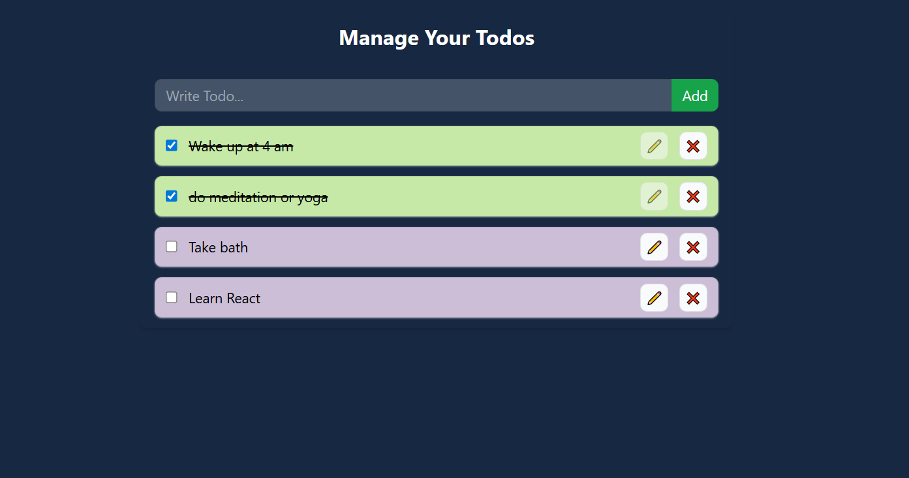

# Todo List Application

## Description
A simple Todo List app built with React.js, allowing users to add, edit, toggle, and delete tasks. Uses local storage for persistence and Tailwind CSS for styling.

## Screenshots

## Features
- Add, edit, toggle, and delete todo items.
- Persist tasks using local storage.
- Responsive UI with Tailwind CSS.

## Technologies Used
- React.js
- Tailwind CSS
- JavaScript
- Local Storage API
- Vite 

## Usage

Add tasks via input field.
Toggle completion with checkbox.
Edit tasks with pencil icon (✏️), save with save icon (📁).
Delete tasks with "X" icon (❌).
Tasks persist on refresh via local storage.

## Project Structure

todo-list/
├── src/
│   ├── components/
│   │   ├── TodoForm.jsx
│   │   ├── Todoitem.jsx
│   ├── contexts/
│   │   ├── ToDoContext.jsx
│   ├── App.jsx
│   ├── main.jsx
│   ├── index.css
│   └── App.css
├── images/
│   └── app-screenshot.png
├── public/
├── package.json
└── README.md

## Acknowledgments

Built with React and Tailwind CSS.